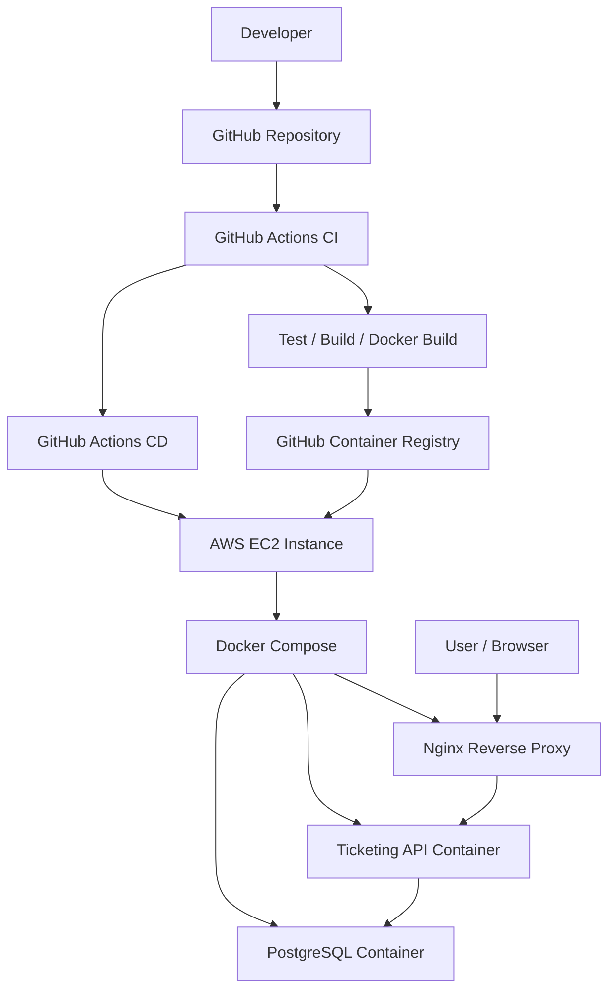
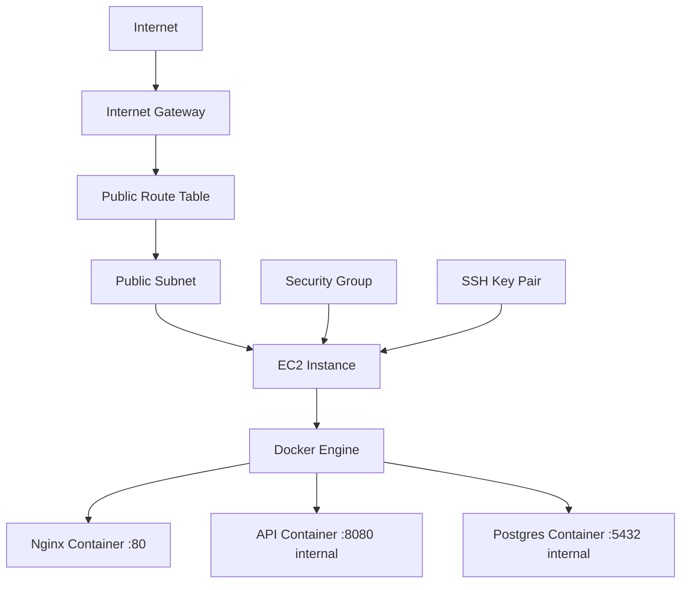
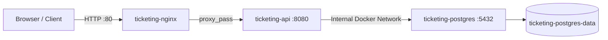
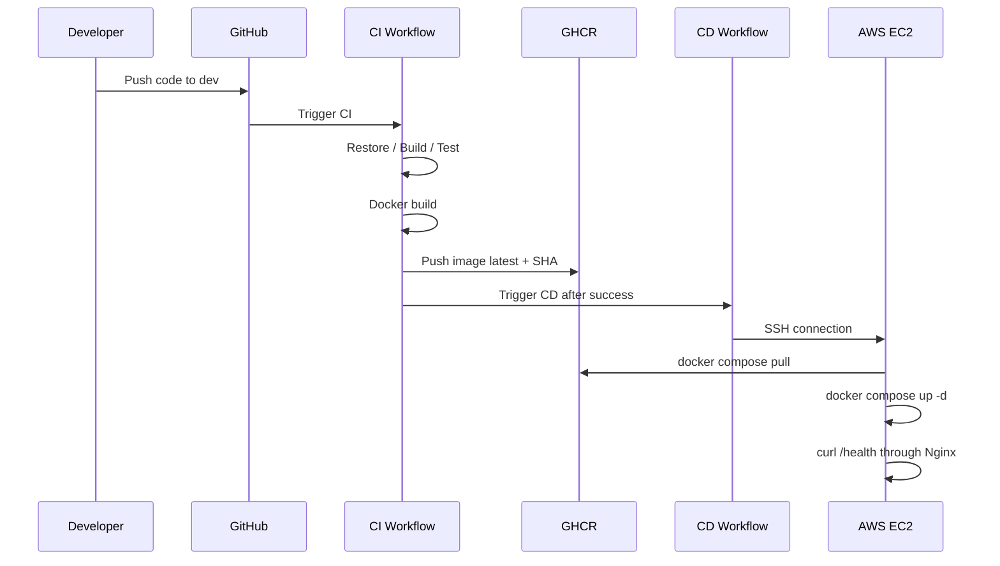
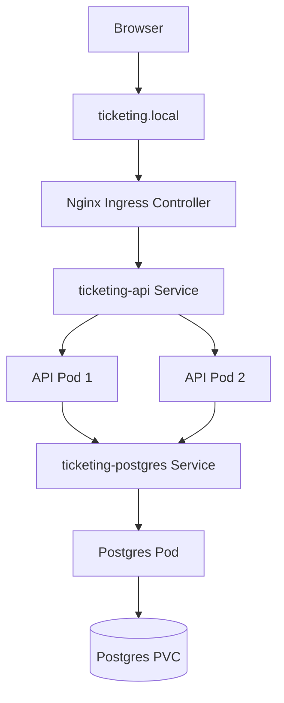

# Ticketing Platform Architecture

This document explains the architecture of the Ticketing Platform DevOps deployment project.

---

## 1. High-Level Deployment Architecture



---

## 2. AWS Infrastructure Architecture



Terraform provisions:

- VPC
- Public subnet
- Internet Gateway
- Route table
- Route to Internet Gateway (`0.0.0.0/0`)
- Route table association
- Security group
- EC2 instance
- Key pair
- User data script

### Future AWS (not in this Terraform)

The current module intentionally stops at **one public subnet, routing to the Internet, one security group, and one EC2 instance**. It does **not** provision Route 53, load balancers, Auto Scaling, RDS, S3, a full CloudWatch operations stack, optional managed in-memory cache services, Lambda, WAF, or similar services. Those are reserved for a later phase if you extend the infrastructure.

---

## 3. Docker Compose Production Architecture



### Public Ports

| Service | Public Port | Notes |
|---|---:|---|
| Nginx | 80 | Public entry point |
| API | Not public | Exposed internally only |
| PostgreSQL | Not public | Internal only |

---

## 4. Nginx Reverse Proxy Architecture

Before Nginx:

```text
Browser → EC2_PUBLIC_IP:8080 → API
```

After Nginx:

```text
Browser → EC2_PUBLIC_IP:80 → Nginx → ticketing-api:8080
```

Benefits:

- Hides the API internal port
- Uses standard HTTP port 80
- Prepares the app for HTTPS/domain setup
- Centralizes public routing
- Allows access logging and rate limiting later

---

## 5. CI/CD Architecture



---

## 6. Kubernetes Local Architecture



Kubernetes objects:

- Namespace: `ticketing`
- ConfigMap: non-sensitive API configuration
- Secret: sensitive configuration
- PVC: PostgreSQL persistence
- PostgreSQL Deployment
- PostgreSQL Service
- API Deployment
- API Service
- Ingress
- Readiness and liveness probes

---

## 7. Kubernetes Request Flow

```text
Browser
  ↓
http://ticketing.local
  ↓
Nginx Ingress Controller
  ↓
Ingress rule
  ↓
ticketing-api Service
  ↓
API Pod
  ↓
ticketing-postgres Service
  ↓
Postgres Pod + PVC
```

---

## 8. Health Check Strategy

The API exposes:

```text
/health
```

The health endpoint checks:

- API process availability
- PostgreSQL database connectivity

Used by:

- GitHub Actions CD deployment validation
- Kubernetes readiness probe
- Kubernetes liveness probe
- Manual deployment testing

---

## 9. Rolling Update Strategy

The API Deployment uses:

```yaml
strategy:
  type: RollingUpdate
  rollingUpdate:
    maxUnavailable: 0
    maxSurge: 1
```

Meaning:

- Kubernetes starts a new Pod before terminating an old one.
- The application remains available during updates.
- If the new version fails, the old version keeps serving traffic.

---

## 10. Rollback Scenario

A bad image was deployed intentionally:

```bash
kubectl set image deployment/ticketing-api \
  ticketing-api=ghcr.io/yassin4276/ticketing-api:bad-version \
  -n ticketing
```

The new Pod failed with `ImagePullBackOff`, but old Pods kept running.

Rollback command:

```bash
kubectl rollout undo deployment/ticketing-api -n ticketing
```

Result:

- Deployment returned to healthy state
- API stayed available
- Health check remained successful
